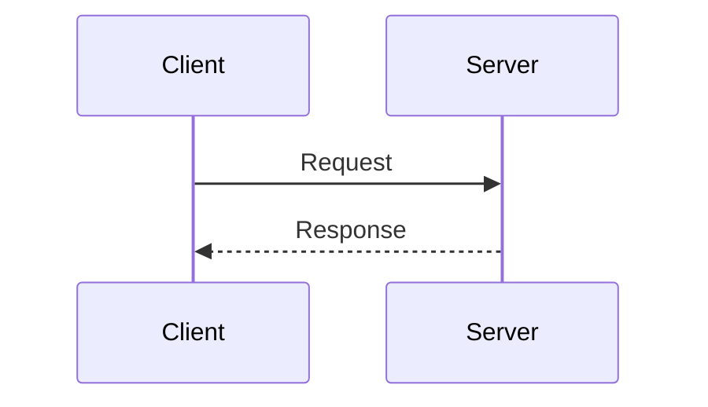

# Sample Tech Post 2

Delete this file and add your own posts to `src/content/tech/`.

## Sample Code Block

```javascript
function hello(name) {
  return `Hello, ${name}!`
}
```

## Sample Mermaid Sequence


