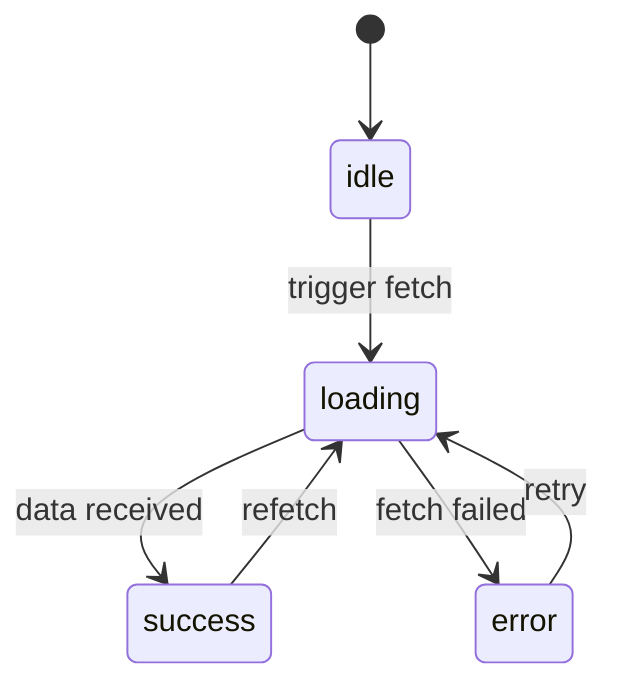

# React Patterns — Những Pattern Tôi Dùng Thực Tế

Có hàng chục React patterns được viết đi viết lại trên blog. Bài này chỉ ghi lại những cái tôi thực sự dùng trong production — với lý do tại sao và khi nào nên tránh.

## Compound Components

Khi bạn có một component phức tạp với nhiều phần liên quan:

```typescript
// Thay vì một component khổng lồ với 15 props...
<Modal
  title="Confirm"
  footer={<><Button>Cancel</Button><Button>OK</Button></>}
  onClose={...}
  isOpen={...}
/>

// Dùng compound components:
<Modal isOpen={isOpen} onClose={close}>
  <Modal.Header>Confirm</Modal.Header>
  <Modal.Body>Are you sure?</Modal.Body>
  <Modal.Footer>
    <Button onClick={close}>Cancel</Button>
    <Button variant="primary" onClick={confirm}>OK</Button>
  </Modal.Footer>
</Modal>
```

Implement với Context:

```typescript
const ModalContext = createContext<{ close: () => void } | null>(null)

function Modal({ isOpen, onClose, children }: Props) {
  if (!isOpen) return null
  return (
    <ModalContext.Provider value={{ close: onClose }}>
      <div className="modal-overlay" onClick={onClose}>
        <div className="modal" onClick={e => e.stopPropagation()}>
          {children}
        </div>
      </div>
    </ModalContext.Provider>
  )
}

Modal.Header = function ModalHeader({ children }: { children: ReactNode }) {
  return <div className="modal-header">{children}</div>
}
// ... tương tự cho Body, Footer
```

## Custom Hook cho async state

Pattern này tôi dùng ở mọi nơi có fetch:

```typescript
type AsyncState<T> =
  | { status: 'idle' }
  | { status: 'loading' }
  | { status: 'success'; data: T }
  | { status: 'error'; error: Error }

function useAsync<T>(fn: () => Promise<T>, deps: DependencyList) {
  const [state, setState] = useState<AsyncState<T>>({ status: 'idle' })

  useEffect(() => {
    let cancelled = false
    setState({ status: 'loading' })

    fn()
      .then(data => {
        if (!cancelled) setState({ status: 'success', data })
      })
      .catch(error => {
        if (!cancelled) setState({ status: 'error', error })
      })

    return () => { cancelled = true }
  }, deps)

  return state
}
```

`cancelled = true` trong cleanup giải quyết race condition khi component unmount trước khi fetch xong.

## Luồng xử lý state



## Render Props (vẫn còn hữu ích)

Hooks đã thay thế phần lớn render props, nhưng pattern này vẫn tốt khi bạn cần inject UI logic vào parent:

```typescript
interface RenderProps {
  isHovered: boolean
  ref: RefObject<HTMLElement>
}

function Hoverable({ children }: { children: (props: RenderProps) => ReactNode }) {
  const [isHovered, setIsHovered] = useState(false)
  const ref = useRef<HTMLElement>(null)

  return children({ isHovered, ref })
}

// Sử dụng:
<Hoverable>
  {({ isHovered, ref }) => (
    <div ref={ref} style={{ opacity: isHovered ? 1 : 0.7 }}>
      Content
    </div>
  )}
</Hoverable>
```

## Khi nào không nên dùng pattern

| Pattern | Đừng dùng khi |
|---|---|
| Compound components | Component chỉ có 2–3 props đơn giản |
| Context | Chỉ cần pass 1–2 level xuống |
| Custom hook | Logic chỉ dùng ở 1 chỗ |
| Render props | Hook có thể giải quyết được |

Overengineering cũng là bug. Pattern đẹp mà không cần thiết = technical debt tương lai.
