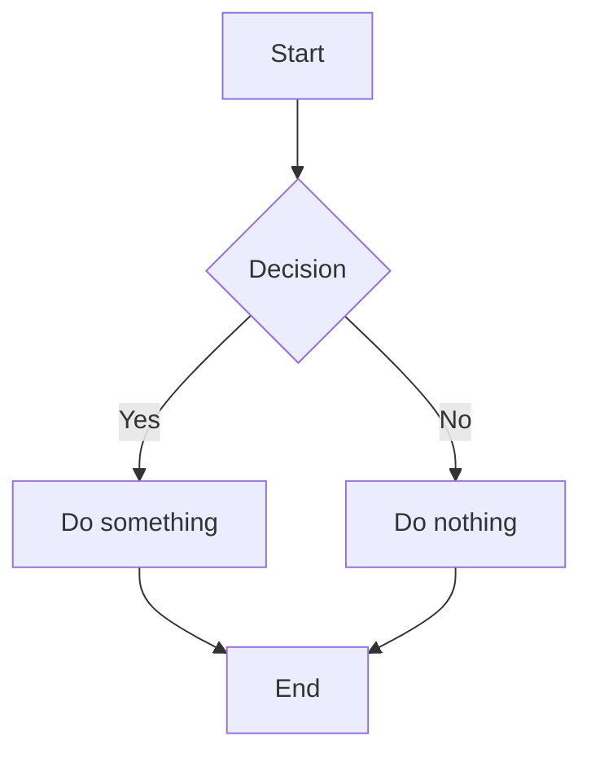

# Sample Tech Post

This is a sample post. Replace with your own content in `src/content/tech/`.

## Sample Code Block

```typescript
function sample<T>(value: T): T {
  return value
}
```

## Sample Mermaid Diagram



## Sample Table

| Column A | Column B | Column C |
|----------|----------|----------|
| Row 1    | Value    | Value    |
| Row 2    | Value    | Value    |
