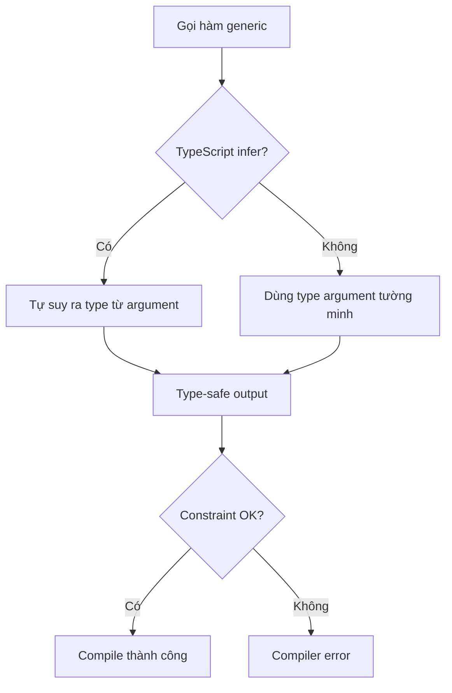

# TypeScript Generics — Từ Cơ Bản đến Conditional Types

Generics là tính năng mạnh nhất của TypeScript mà nhiều người dùng chưa đúng cách. Bài này đi từ cơ bản đến advanced — tập trung vào những pattern thực tế, không lý thuyết suông.

## Generic Constraints

Khi bạn muốn giới hạn type parameter chấp nhận:

```typescript
function getProperty<T, K extends keyof T>(obj: T, key: K): T[K] {
  return obj[key]
}

const user = { name: 'Quan', age: 28 }
getProperty(user, 'name')  // OK: string
getProperty(user, 'xyz')   // Error: Argument of type '"xyz"' is not assignable
```

## Luồng type inference



## Conditional Types

Conditional types cho phép chọn type dựa trên điều kiện:

```typescript
type IsArray<T> = T extends any[] ? 'yes' : 'no'

type A = IsArray<string[]>  // 'yes'
type B = IsArray<string>    // 'no'
```

Pattern quan trọng hơn — **infer**:

```typescript
type UnpackArray<T> = T extends Array<infer Item> ? Item : T

type Nums = UnpackArray<number[]>  // number
type Str  = UnpackArray<string>    // string (không phải array, giữ nguyên)
```

## Mapped Types kết hợp Generics

```typescript
type Readonly<T> = {
  readonly [K in keyof T]: T[K]
}

type Optional<T> = {
  [K in keyof T]?: T[K]
}

// Chỉ optional một số field
type PartialBy<T, K extends keyof T> = Omit<T, K> & Optional<Pick<T, K>>

interface User {
  id: number
  name: string
  email: string
}

type CreateUserInput = PartialBy<User, 'id'>
// { id?: number; name: string; email: string }
```

## Template Literal Types

```typescript
type EventName<T extends string> = `on${Capitalize<T>}`

type ClickEvent  = EventName<'click'>   // 'onClick'
type ChangeEvent = EventName<'change'>  // 'onChange'

// Kết hợp với mapped types:
type EventHandlers<T extends string> = {
  [K in T as EventName<K>]?: () => void
}

type ButtonHandlers = EventHandlers<'click' | 'focus' | 'blur'>
// { onClick?: () => void; onFocus?: () => void; onBlur?: () => void }
```

## Khi nào dùng generic vs union?

| Tình huống | Dùng |
|---|---|
| Function xử lý nhiều type nhưng return cùng type với input | Generic |
| Giá trị có thể là một trong vài type cụ thể | Union |
| Muốn preserve type relationship giữa input/output | Generic |
| Type không liên quan nhau | Union |

## Tóm lại

Generics tốt nhất khi **type của output phụ thuộc vào type của input**. Khi không có relationship đó, union type thường đơn giản và đủ dùng hơn.
