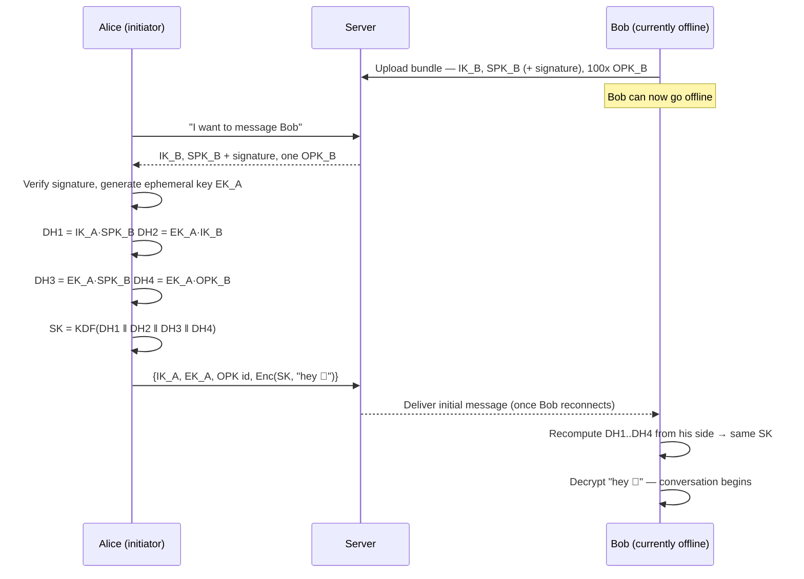

# End-to-End Encrypted 1:1 Chat: How X3DH Builds a Secret Between Strangers

When you open a private chat in Signal, WhatsApp, or iMessage, the app has to pull off something that sounds almost paradoxical: two people who have never met, talking through a server neither of them trusts, must agree on a secret key — and one of them might not even be online yet. The protocol that makes this possible is **X3DH** (Extended Triple Diffie-Hellman), designed by the Signal team and now the bootstrap step behind most modern 1:1 E2EE systems.

This post walks through how X3DH works, why it needs four key pairs instead of one, and then gets hands-on: a Go service that manages those keys, a Vue.js client that runs the handshake in the browser, and — for anyone who'd rather skip the algebra — the same idea explained with nothing but small numbers.

## The problem: agreeing on a secret while offline

Classic Diffie-Hellman key exchange needs both sides online at the same time: Alice sends a value, Bob replies with his, and each combines the two into a shared secret. That doesn't work for messaging — Bob's phone might be off, out of signal, or asleep in airplane mode, yet Alice should still be able to send the very first message, encrypted, the moment she opens the conversation.

X3DH solves this by having Bob pre-publish some key material to a server *in advance*. Alice fetches it whenever she likes, runs the entire handshake on her own, and fires off an encrypted message immediately. Bob completes his half of the handshake later, whenever he reconnects — and lands on exactly the same secret.

## The four keys in the handshake

| Key | Lifetime | Purpose |
|---|---|---|
| **IK** — Identity Key | Permanent (per account) | Anchors "this is really Bob"; published once, rarely changes |
| **SPK** — Signed Prekey | Days to weeks | Rotated periodically; signed by IK so peers can verify it came from Bob |
| **OPK** — One-Time Prekey | Single use | Uploaded in batches of ~100; the server hands one out per new conversation, then discards it |
| **EK** — Ephemeral Key | Single handshake | Generated fresh by Alice, the initiator, just for this exchange |

Combining four keys — rather than the usual two — is what gives X3DH its guarantees: **mutual authentication** (each side proves possession of its identity key), **forward secrecy** (a long-term key leaking later doesn't expose this session), and **deniability** (neither party can cryptographically prove to a third party who said what).

## The handshake, step by step



Alice performs **four** separate Diffie-Hellman agreements and folds the results through a key derivation function (HKDF) into one session key `SK`. Each agreement pairs a long-term key against an ephemeral one (or vice versa), so that even if an attacker later steals someone's long-term identity key, they still can't reconstruct *this* session's secret.

## The same idea, with just numbers

If the algebra above feels abstract, here's the same *trick* — agreeing on a shared secret over a channel an eavesdropper can watch — using arithmetic small enough to do by hand. (Real systems use elliptic curves over enormous numbers; the shape of the trick is identical.)

Alice and Bob start by publicly agreeing on two numbers anyone can know: a "base" `g = 5` and a "modulus" `p = 23`.

1. Alice privately picks a secret `a = 6` and publishes `A = 5⁶ mod 23 = 8`
2. Bob privately picks a secret `b = 15` and publishes `B = 5¹⁵ mod 23 = 19`
3. Alice computes `B^a mod 23 = 19⁶ mod 23 = 2`
4. Bob computes `A^b mod 23 = 8¹⁵ mod 23 = 2`

Both land on **2** — their shared secret — without ever transmitting `a` or `b`. An eavesdropper who only sees `5`, `23`, `8`, and `19` would have to work backwards from `8 = 5^a mod 23` to recover `a` (the "discrete logarithm" problem). For numbers this small that's easy, but for the 256-bit numbers real systems use, it would take longer than the age of the universe with every computer on Earth combined.

X3DH simply runs this "agree on a secret number" trick **four times**, once per key pair in the table above, then mixes the four results together. Two of those key pairs — Bob's signed prekey and one-time prekey — were published to the server in advance, which is *exactly* what lets Alice finish her half of the calculation before Bob ever comes online.

## Managing keys in Go

A key manager's job here boils down to one function: take whichever DH agreements are available and fold them, *in a fixed order*, into a session key. Everything else — generating the four key types, persisting them, signing the prekey, burning a one-time key after use — is bookkeeping around this core. Using the standard library's `crypto/ecdh` (X25519) and `golang.org/x/crypto/hkdf`:

```go
// deriveSessionKey is the one piece of X3DH that actually matters: chain
// the available DH outputs and run them through HKDF. Both Alice and Bob
// call this with their own keys, in this exact order, and land on the
// same 32-byte SK — dh4 is nil whenever no one-time prekey was used.
func deriveSessionKey(dh1, dh2, dh3, dh4 []byte) ([]byte, error) {
	material := append(append(append([]byte{}, dh1...), dh2...), dh3...)
	if dh4 != nil {
		material = append(material, dh4...)
	}

	h := hkdf.New(sha256.New, material, nil, []byte("x3dh-session-key-v1"))
	sessionKey := make([]byte, 32)
	_, err := io.ReadFull(h, sessionKey)
	return sessionKey, err
}
```

Bob's side calls it with `dh1 = SPK·IK_A`, `dh2 = IK·EK_A`, `dh3 = SPK·EK_A`, `dh4 = OPK·EK_A` (each an `(*ecdh.PrivateKey).ECDH(peerPublicKey)` call); Alice's side computes the mirror image. **Order is everything** — swap two arguments and the two sides derive different keys with no error to warn you. That's also why the initial message carries the one-time prekey's ID alongside Alice's public keys: it tells Bob exactly which (now-to-be-deleted) prekey to plug back in as `dh4`.

## A Vue.js client

On the browser side, the interesting part isn't the chat UI scaffolding (a `reactive` thread, a `<form>`, a fetch call to send the encrypted payload) — it's the handful of lines that turn a fetched prekey bundle into a session key. Here's that core, written against [libsodium](https://github.com/jedisct1/libsodium.js) inside a `<script setup>` component:

```js
// Initiator side: chain the four scalar-multiplications in the same
// order Bob's responder code uses, then derive the session key.
async function deriveSessionKey(myIdentity, myEphemeral, bundle) {
  const dh1 = sodium.crypto_scalarmult(myIdentity.privateKey, bundle.signedPreKey)
  const dh2 = sodium.crypto_scalarmult(myEphemeral.privateKey, bundle.identityKey)
  const dh3 = sodium.crypto_scalarmult(myEphemeral.privateKey, bundle.signedPreKey)
  const dh4 = bundle.oneTimePreKey
    ? sodium.crypto_scalarmult(myEphemeral.privateKey, bundle.oneTimePreKey)
    : new Uint8Array(0)

  // In production, fold these through HKDF — crypto_generichash is shown
  // here only to keep the snippet dependency-free.
  return sodium.crypto_generichash(32, concatBytes(dh1, dh2, dh3, dh4), sodium.from_string('x3dh-session-key-v1'))
}
```

Everything around it follows a predictable shape: fetch `/api/users/:id/prekey-bundle`, call `deriveSessionKey`, then hand the result to `sodium.crypto_secretbox_easy` to encrypt the first message and `crypto_secretbox_NONCEBYTES`-sized random nonce alongside it. Nothing sensitive — private keys, the derived session key, plaintext — ever leaves the browser; the server only ever sees public keys and ciphertext.

## Beyond the handshake: the Double Ratchet

X3DH only gets the conversation *started*. Production systems immediately hand the resulting session key `SK` to a **Double Ratchet** (also from the Signal protocol), which derives a fresh key for every single message. That's what gives you the property that compromising today's key doesn't expose yesterday's messages — or tomorrow's.

## A short checklist for running this in production

- Rotate signed prekeys every few days and re-sign them with the identity key
- Keep the one-time prekey pool topped up; once it runs dry, new conversations silently fall back to triple-DH (still safe, just missing the fourth agreement)
- Let users compare "safety numbers" — a fingerprint of both identity keys — out of band, to catch a man-in-the-middle
- Hand the derived session key straight to a ratchet; never reuse it to encrypt more than the very first message
