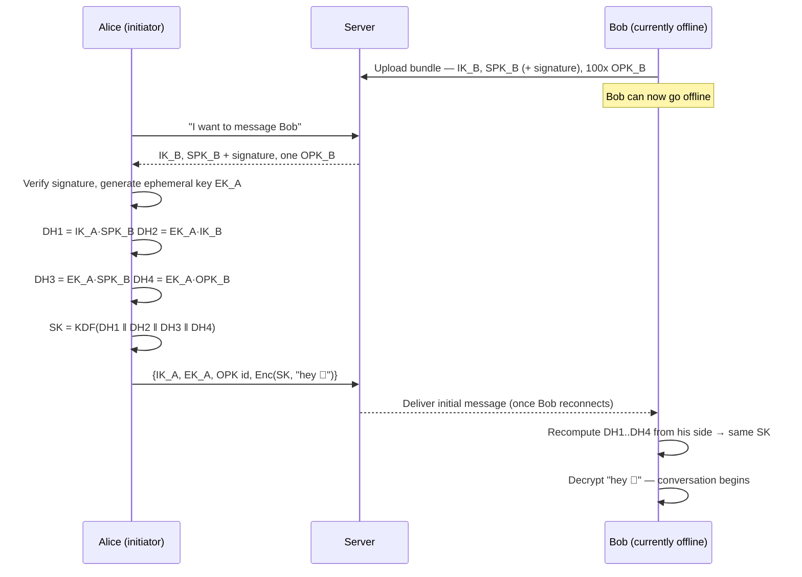

When you open a private chat in a Signal-style messenger, the app has to pull off something that sounds almost paradoxical: two devices that have never exchanged session state, talking through a server they do not trust with plaintext, must agree on a secret — and the recipient might not even be online. **X3DH** (Extended Triple Diffie-Hellman), designed by Signal, is one well-specified way to bootstrap that asynchronous 1:1 session.

X3DH is only a key agreement. It does not define chat transport, message history, attachment encryption, multi-device reconciliation, or the fresh key used for every later message. Its output initializes a post-X3DH protocol—normally the Double Ratchet.

## The problem: agreeing on a secret while offline

Classic Diffie-Hellman key exchange needs both sides online at the same time: Alice sends a value, Bob replies with his, and each combines the two into a shared secret. That doesn't work for messaging — Bob's phone might be off, out of signal, or asleep in airplane mode, yet Alice should still be able to send the very first message, encrypted, the moment she opens the conversation.

X3DH solves this by having Bob pre-publish some key material to a server *in advance*. Alice fetches it whenever she likes, runs the entire handshake on her own, and fires off an encrypted message immediately. Bob completes his half of the handshake later, whenever he reconnects — and lands on exactly the same secret.

## The four keys in the handshake

| Key | Lifetime | Purpose |
|---|---|---|
| **IK** — Identity Key | Long-lived (per device in many apps) | Anchors continuity for a device identity; meaningful authentication still requires verification or a trusted directory |
| **SPK** — Signed Prekey | Days to weeks | Rotated periodically; signed by IK so peers can verify it came from Bob |
| **OPK** — One-Time Prekey | Single use | Uploaded in batches of ~100; the server hands one out per new conversation, then discards it |
| **EK** — Ephemeral Key | Single handshake | Generated fresh by Alice, the initiator, just for this exchange |

The names in the table describe *roles*, not four total key pairs. A complete run involves `IK_A`, `EK_A`, `IK_B`, `SPK_B`, and optionally one `OPK_B`: five public keys across two parties. “X3” refers to the three mandatory DH results. The one-time prekey adds a fourth DH when available.

The signed prekey proves that whoever controls Bob’s identity signing key authorized `SPK_B`; it does not prove that the server returned the real Bob’s identity key in the first place. That final binding comes from a trusted identity directory, key transparency, a previously stored identity, or an out-of-band fingerprint/QR comparison.

## The handshake, step by step



Alice performs **four** separate Diffie-Hellman agreements and folds the results through a key derivation function (HKDF) into one session key `SK`. Each agreement pairs a long-term key against an ephemeral one (or vice versa), so that even if an attacker later steals someone's long-term identity key, they still can't reconstruct *this* session's secret.

More precisely, DH4 is optional:

```text
DH1 = DH(IK_A, SPK_B)   // Alice identity ↔ Bob signed prekey
DH2 = DH(EK_A, IK_B)    // Alice ephemeral ↔ Bob identity
DH3 = DH(EK_A, SPK_B)   // Alice ephemeral ↔ Bob signed prekey
DH4 = DH(EK_A, OPK_B)   // optional one-time contribution

SK = HKDF(DH1 || DH2 || DH3 [|| DH4], applicationInfo)
```

The X3DH specification also defines curve-specific input formatting and HKDF parameters. These are protocol bytes, not stylistic choices. Two implementations that merely “concatenate and hash something similar” can derive incompatible keys or lose domain separation.

Alice then encrypts the initial message with an authenticated-encryption scheme under a key derived from `SK`. The associated data includes both parties’ encoded identity keys. That identity binding prevents a valid ciphertext from being transplanted into a handshake that names different identities.

## The same idea, with just numbers

If the algebra above feels abstract, here's the same *trick* — agreeing on a shared secret over a channel an eavesdropper can watch — using arithmetic small enough to do by hand. (Real systems use elliptic curves over enormous numbers; the shape of the trick is identical.)

Alice and Bob start by publicly agreeing on two numbers anyone can know: a "base" `g = 5` and a "modulus" `p = 23`.

1. Alice privately picks a secret `a = 6` and publishes `A = 5⁶ mod 23 = 8`
2. Bob privately picks a secret `b = 15` and publishes `B = 5¹⁵ mod 23 = 19`
3. Alice computes `B^a mod 23 = 19⁶ mod 23 = 2`
4. Bob computes `A^b mod 23 = 8¹⁵ mod 23 = 2`

Both land on **2** — their shared secret — without ever transmitting `a` or `b`. An eavesdropper who only sees `5`, `23`, `8`, and `19` would have to work backwards from `8 = 5^a mod 23` to recover `a` (the "discrete logarithm" problem). For numbers this small that's easy, but for the 256-bit numbers real systems use, it would take longer than the age of the universe with every computer on Earth combined.

X3DH runs this "agree on a secret number" trick **three times, plus an optional fourth**, across different combinations of long-lived, signed, ephemeral, and one-time keys, then mixes the results together. Bob's signed prekey and one-time prekeys were published to the server in advance, which is exactly what lets Alice finish her half before Bob comes online.

## Managing keys in Go

A key manager's job here boils down to one function: take whichever DH agreements are available and fold them, *in a fixed order*, into a session key. Everything else — generating the four key types, persisting them, signing the prekey, burning a one-time key after use — is bookkeeping around this core. Using the standard library's `crypto/ecdh` (X25519) and `golang.org/x/crypto/hkdf`:

```go
// This is an integration sketch, not a replacement for the X3DH spec.
// Both devices must use the protocol's exact curve encoding, F prefix,
// salt, INFO value, DH ordering, and output length. dh4 is nil when the
// fetched bundle did not contain a one-time prekey.
func deriveSessionKey(dh1, dh2, dh3, dh4, protocolPrefix []byte) ([]byte, error) {
	material := append(append(append([]byte{}, dh1...), dh2...), dh3...)
	if dh4 != nil {
		material = append(material, dh4...)
	}

	material = append(append([]byte{}, protocolPrefix...), material...)
	h := hkdf.New(sha256.New, material, make([]byte, 32), []byte("my-app-x3dh-v1"))
	sessionKey := make([]byte, 32)
	_, err := io.ReadFull(h, sessionKey)
	return sessionKey, err
}
```

Bob's side calls it with `dh1 = SPK_B·IK_A`, `dh2 = IK_B·EK_A`, `dh3 = SPK_B·EK_A`, `dh4 = OPK_B·EK_A`; Alice computes the mirror image. **Order is everything**—swap two inputs and the devices derive different keys with no useful error. The initial message carries the used prekey IDs plus Alice’s identity and ephemeral public keys so Bob can locate the correct private material.

Do not ship this helper as a home-grown X3DH implementation. A real library must also reject invalid public keys and all-zero DH outputs, compare signatures safely, separate protocol domains, use constant-time primitives, and manage deletion transactionally.

## A Vue.js client

On the browser side, the interesting part isn't the chat UI scaffolding (a `reactive` thread, a `<form>`, a fetch call to send the encrypted payload) — it's the handful of lines that turn a fetched prekey bundle into a session key. Here's that core, written against [libsodium](https://github.com/jedisct1/libsodium.js) inside a `<script setup>` component:

```js
// Initiator side: chain the four scalar-multiplications in the same
// order Bob's responder code uses, then derive the session key.
async function deriveSessionKey(myIdentity, myEphemeral, bundle) {
  const dh1 = sodium.crypto_scalarmult(myIdentity.privateKey, bundle.signedPreKey)
  const dh2 = sodium.crypto_scalarmult(myEphemeral.privateKey, bundle.identityKey)
  const dh3 = sodium.crypto_scalarmult(myEphemeral.privateKey, bundle.signedPreKey)
  const dh4 = bundle.oneTimePreKey
    ? sodium.crypto_scalarmult(myEphemeral.privateKey, bundle.oneTimePreKey)
    : new Uint8Array(0)

  // In production, fold these through HKDF — crypto_generichash is shown
  // here only to keep the snippet dependency-free.
  return sodium.crypto_generichash(32, concatBytes(dh1, dh2, dh3, dh4), sodium.from_string('x3dh-session-key-v1'))
}
```

Everything around it follows a predictable shape: fetch a bundle, verify the signed prekey, derive `SK`, and use an approved post-X3DH construction to protect the initial message. In a web client, browser storage, extension access, XSS, build integrity, and cross-device key storage become part of the E2EE threat model. “The crypto ran in JavaScript” does not by itself mean the server cannot replace that JavaScript or steal its keys.

## Beyond the handshake: the Double Ratchet

X3DH only gets the conversation *started*. Production systems immediately hand the resulting session key `SK` to a **Double Ratchet** (also from the Signal protocol), which derives a fresh key for every single message. That's what gives you the property that compromising today's key doesn't expose yesterday's messages — or tomorrow's.

The initiator cannot claim post-compromise healing merely because X3DH used an ephemeral key. Healing depends on fresh secret input arriving after the compromise, which is the Double Ratchet’s job. Likewise, the exact forward-secrecy result depends on which private prekeys have been securely deleted and what an attacker compromised.

## Authentication: what X3DH proves and what the product must add

X3DH gives Alice cryptographic evidence that the holder of `IK_B` signed Bob’s prekey and can derive the matching session. It does not tell Alice that `IK_B` belongs to the human she calls Bob if a malicious service substituted both values on first contact.

A complete product therefore needs an identity policy:

- **Trust on first use:** remember the first identity key and warn on change.
- **Manual verification:** compare a fingerprint or scan a QR code out of band.
- **Key transparency:** let clients audit a consistent public mapping from account/device to identity key.
- **Enterprise credentials:** validate a device certificate against the organization’s identity policy.

Key-change UX is security behavior, not decoration. Automatically accepting a new identity after reinstall makes recovery smooth but also gives a compromised server a clean substitution path. Blocking forever makes legitimate recovery unusable. Many products quarantine the change, display a strong warning, and require policy-dependent approval.

## Production edge cases

### The one-time-prekey pool is empty

Alice runs the three mandatory DH operations without DH4. The session can still be established, but it loses the extra protection that a genuinely single-use prekey provides. The service should monitor pool levels and clients should replenish in batches without uploading private keys.

### Two initiators receive the same OPK

A race, retry, restored server snapshot, or malicious delivery service may hand one prekey to more than one initiator. Bob must delete the OPK private key after a successful use, and the application must decide how to handle a second initial message referencing the consumed ID. Treat server-side “pop once” as an optimization; endpoint logic must not assume the server is honest.

### The initial message is replayed

When no OPK is used, the X3DH specification notes that an initial message can be replayed and accepted. Even with an OPK, backup restoration or non-atomic deletion can reintroduce risk. The post-X3DH protocol should quickly mix in fresh responder randomness, and the application can keep bounded identifiers for already-processed initial messages.

### Bob rotates the signed prekey while Alice is offline

Alice may have fetched yesterday’s bundle and deliver the initial message next week. Bob should retain the old signed-prekey private key for a bounded grace period, then delete it. Rotating instantly makes delayed messages undecryptable; retaining every old key forever weakens forward secrecy.

### The server returns a stale bundle

A valid signature does not prove freshness. Bundles need IDs, creation/expiry policy, and signed-prekey rotation. If Alice already knows Bob’s identity key, a rollback to a different key must trigger the identity-change policy rather than silently starting a session.

### The first ciphertext is lost after the OPK is reserved

The server may have removed an OPK even though Bob never receives the corresponding message. That wastes one key but is safer than giving it out repeatedly. Replenishment and retry with a fresh bundle are normal operations.

### Multi-device users

X3DH establishes a session between **devices**, not abstract humans. If Bob owns a phone, tablet, and desktop, each device publishes its own bundle and Alice starts a separate session with each authorized device. Adding or removing a device is a membership and identity problem above X3DH; encrypting once to an account does not magically reach every endpoint.

### Restore resurrects deleted prekeys

Backing up identity continuity may be desirable, but restoring consumed OPKs or old ratchet state can enable replay and weaken deletion-based guarantees. Backup schemas should distinguish long-lived identity material from single-use and obsolete session secrets.

### The bundle signature fails

Stop. Do not “try without verification,” fall back to a different curve, or accept the bundle because the chat is urgent. A failed signed-prekey check means corruption, implementation disagreement, or active substitution.

## A short checklist for running this in production

- Rotate signed prekeys every few days and re-sign them with the identity key
- Keep the one-time prekey pool topped up; once it runs dry, new conversations silently fall back to triple-DH (still safe, just missing the fourth agreement)
- Let users compare "safety numbers" — a fingerprint of both identity keys — out of band, to catch a man-in-the-middle
- Hand the derived session key straight to a ratchet; never reuse it to encrypt more than the very first message
- Treat each device as a separate cryptographic recipient and define device add/remove policy
- Make OPK allocation, consumption, and private-key deletion durable across crashes and retries
- Retain old signed prekeys only for a bounded delayed-message window
- Bind both identity keys as associated data and domain-separate every KDF use
- Never silently accept identity-key changes
- Test stale bundles, duplicate OPKs, replayed initial messages, pool exhaustion, lost first delivery, reinstall, and restored backups

## Further reading

- [Signal’s X3DH specification](https://signal.org/docs/specifications/x3dh/)
- [The Sesame algorithm for asynchronous multi-device session management](https://signal.org/docs/specifications/sesame/)
- [After the Handshake: the Double Ratchet](/tech/2026-e2ee-double-ratchet)
