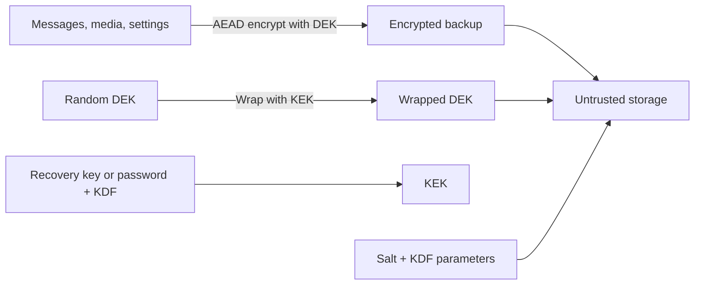

End-to-end encryption is comparatively straightforward while a device is alive: the device owns the keys and decrypts locally. Backup changes the problem. The ciphertext must survive the loss of the device, but the storage provider must still be unable to read it.

That creates two separate jobs:

- encrypt a potentially huge and frequently changing archive efficiently;
- make the encryption key recoverable on a new device without giving the server that key.

Envelope encryption separates those jobs with a **Data Encryption Key (DEK)** and a **Key Encryption Key (KEK)**.

## The two-key model

The DEK is a strong random symmetric key used to encrypt the actual data. The KEK encrypts—or **wraps**—the DEK.



The server may store all of these:

- encrypted archive chunks;
- wrapped DEK;
- public salt and KDF parameters;
- nonces, authentication tags, version numbers, and a manifest.

It must not possess enough information to derive or unwrap the KEK. If the server can silently recover the KEK on its own, the design is encrypted at rest, but it is not end-to-end encrypted backup.

## Why not encrypt the whole backup with the recovery password?

Human passwords have low and uneven entropy. They should not be used directly as AES keys, and a multi-gigabyte archive should not need to be re-encrypted every time the password changes.

Instead:

1. Generate the DEK from a cryptographically secure random source.
2. Encrypt the data with the DEK using an authenticated-encryption scheme such as AES-256-GCM or XChaCha20-Poly1305.
3. Derive a KEK from the recovery credential using a password KDF such as Argon2id when the credential is human-memorable.
4. Encrypt the DEK with that KEK.
5. Store the wrapped DEK next to the ciphertext.

Changing the recovery credential then requires re-wrapping only a small DEK—not re-encrypting every photo and message.

If the recovery key is already a uniformly random 256-bit secret, a password-stretching KDF is not needed for brute-force resistance. A labeled HKDF can derive independent KEKs and authentication keys from it. The product should not confuse a random recovery key with a short PIN.

## A concrete backup format

A versioned manifest could look like this:

```json
{
  "format": 3,
  "backupId": "bkp_7e3...",
  "kdf": {
    "name": "argon2id",
    "salt": "base64(16 random bytes)",
    "memoryKiB": 65536,
    "iterations": 3,
    "parallelism": 1
  },
  "wrap": {
    "algorithm": "xchacha20-poly1305",
    "nonce": "base64(24 random bytes)",
    "wrappedDek": "base64(ciphertext + tag)"
  },
  "chunks": [
    {
      "index": 0,
      "object": "chunks/00000000.bin",
      "nonce": "base64(unique nonce)",
      "sha256": "hash of stored ciphertext"
    }
  ]
}
```

The authenticated data for wrapping should bind the DEK to its context, for example:

`AAD = format || backupId || userPublicId || "backup-dek"`

Each archive chunk should also authenticate its backup ID, chunk index, content type, and schema version. This prevents a server or storage bug from moving a valid encrypted chunk into the wrong backup and having it be accepted as legitimate.

The ciphertext hash is useful for transport corruption and deduplication checks, but it does not replace the AEAD authentication tag. A plain hash is not keyed and cannot prove that the data came from an authorized writer.

## Backup flow

### 1. Create root recovery material

The device either:

- generates a high-entropy recovery key and asks the user to store it; or
- accepts a passphrase and derives a KEK with a memory-hard KDF; or
- receives recovery material through a secure, already-authorized device-to-device channel.

Each option has a different product promise. A random key offers strong offline-guess resistance but is hard to memorize. A password is usable but must be protected against offline guessing. Device escrow is convenient but recovery fails if no trusted device remains.

### 2. Generate DEKs

Use a random DEK per backup generation, per logical database, or per media object depending on scale. One DEK for an entire archive is simple; multiple DEKs reduce blast radius and allow independent retention, deletion, and re-upload.

A useful hierarchy is:

```text
recovery root
  └── KEK for backup version 3
        ├── wraps message-database DEK
        ├── wraps media-index DEK
        └── wraps one DEK per media object or batch
```

Labels and backup IDs must be included in key derivation so the same root cannot accidentally produce interchangeable keys for unrelated purposes.

### 3. Encrypt locally

The device serializes and validates a consistent snapshot, encrypts it in bounded chunks, and uploads only ciphertext. Plaintext DEKs should exist in memory only while needed and should never appear in logs, crash reports, analytics, or filenames.

For very large files, use a streaming construction designed for chunking rather than inventing “AES-GCM but one tag at the end.” A failed upload should leave either a recoverable old backup or a complete new one—not a half-new manifest pointing at missing chunks.

### 4. Publish atomically

Upload chunks first, then publish the authenticated manifest as the final step. Keep the last known-good generation until the new one is verified. This prevents power loss or network failure from replacing a valid backup with an incomplete one.

## Restore flow

Restore is the mirror image, but the order of validation matters:

1. Download the manifest and reject unsupported versions or unreasonable resource parameters.
2. Obtain the recovery credential from the user or an authorized device.
3. Derive the KEK using the exact stored salt and KDF parameters.
4. Unwrap the DEK with the expected authenticated context.
5. Download chunks, validate size limits and AEAD tags, then decrypt locally.
6. Parse into a temporary database and validate referential integrity before replacing live state.
7. Commit the restored state atomically.
8. Remove plaintext temporary files and key material.

A wrong recovery key should fail at DEK unwrapping before gigabytes are downloaded. An error message should distinguish “network unavailable” from “key did not authenticate” for the user, while avoiding detailed oracle behavior in remote APIs.

## Key rotation without re-encrypting everything

The two levels make several rotations possible:

- **Rotate the recovery credential:** derive a new KEK and re-wrap the same DEKs.
- **Rotate a DEK:** decrypt and re-encrypt only the data protected by that DEK, then wrap the new key.
- **Revoke an old device:** stop giving it new backup credentials and generate a new backup generation. Revocation cannot erase plaintext it already restored.
- **Migrate algorithms:** keep explicit version and algorithm identifiers; decrypt with the old format and write a fresh generation with the new format.

Never delete the old wrapped DEK until the replacement manifest and ciphertext are durable and have passed a restore test.

## Edge cases that decide whether the design survives production

### Lost recovery key

In a true no-escrow design, this is permanent data loss. That is not a bug the provider can fix without changing the trust model. The UX must make the consequence clear before the device is lost.

Signal’s Secure Backups, for example, use a device-generated 64-character recovery key that Signal says never reaches its servers; without it, the archive cannot be restored. That is a product expression of the same cryptographic boundary, not evidence that every E2EE backup must copy Signal’s exact format.

### Weak password and offline guessing

If an attacker steals `salt + wrapped DEK`, each password guess can be tested offline by attempting the authenticated unwrap. Rate limiting on your login server does not help. Use Argon2id with parameters calibrated to real client devices, encourage long passphrases, and consider a high-entropy recovery key when the threat model demands it.

### Nonce reuse

Reusing a nonce with the same AEAD key can reveal plaintext relationships or destroy integrity guarantees. A retry must not accidentally reuse a `(DEK, nonce)` pair for different plaintext. Random 192-bit XChaCha nonces are operationally forgiving; counter-based schemes require durable, transactional allocation.

### Rollback and replay

An untrusted server can serve an older, correctly encrypted backup. AEAD alone considers it authentic. Bind monotonically increasing generation information into the manifest and store a trusted latest-generation marker on another authorized device or in a rollback-resistant service if freshness matters.

### Partial restore and corrupt media

Decide whether one bad attachment fails the entire restore or produces a recoverable chat history with a clearly marked missing file. The policy should be explicit, and the database must never reference plaintext that was not authenticated.

### Deleted and disappearing messages

Backup retention can defeat the product’s deletion semantics. Exclude view-once content, expire disappearing messages inside backup generations, and ensure old snapshots are actually retired. Cryptography preserves exactly what you feed it—including data the user believed was gone.

### Multi-device writers

Two devices uploading generation 41 at the same time can fork history. Use a single elected backup writer or compare-and-swap publication against the previous generation. Merging two encrypted archives is an application-level reconciliation problem, not something envelope encryption solves.

### KEK held by the cloud provider

Cloud KMS envelope encryption is excellent protection against disk theft and accidental database exposure. But if the same provider can call KMS to unwrap the DEK without an endpoint-held secret, it remains server-side encryption. The names KEK and DEK do not automatically create E2EE; key custody does.

## What should be backed up?

Backing up the live ratchet/session state of a messaging protocol can weaken forward secrecy by resurrecting deleted keys. Often the safer design is to back up the **message history as a new encrypted archive**, not every obsolete protocol secret that once decrypted it.

The archive has its own DEKs, retention rules, and threat model. Compromise of a backup recovery key may expose the retained archive, but it should not automatically let the attacker impersonate the user in active sessions.

## A design-review checklist

- Is every DEK random, scoped, versioned, and used only with a nonce-safe AEAD construction?
- Can the storage provider derive the KEK or ask another service to do so without an endpoint-held secret?
- Can a stolen backup be guessed offline, and are KDF parameters strong on the weakest supported client?
- Are manifest fields, object identity, chunk order, and schema version authenticated?
- Is publication atomic, and is the previous known-good generation retained until verification?
- Can the system detect rollback, duplicate writers, missing chunks, and unsupported algorithms?
- Does credential rotation re-wrap keys safely without a window that destroys the only recoverable copy?
- Do deletion and disappearing-message semantics remain true after backup?
- Has the team tested restore—not merely upload—after device loss, app upgrade, interrupted transfer, and partial corruption?

DEK and KEK are simple labels, but they enforce a valuable separation of concerns. The DEK makes bulk encryption fast and granular. The KEK makes recovery and rotation manageable. E2EE comes from the final boundary: only an authorized endpoint can obtain the material that unwraps the data keys.

## Further reading

- [AWS KMS: How data keys and encrypted data keys work](https://docs.aws.amazon.com/kms/latest/developerguide/data-keys.html)
- [RFC 9106: Argon2 memory-hard password hashing](https://www.rfc-editor.org/rfc/rfc9106.html)
- [Signal: Introducing Secure Backups](https://signal.org/blog/introducing-secure-backups/)
