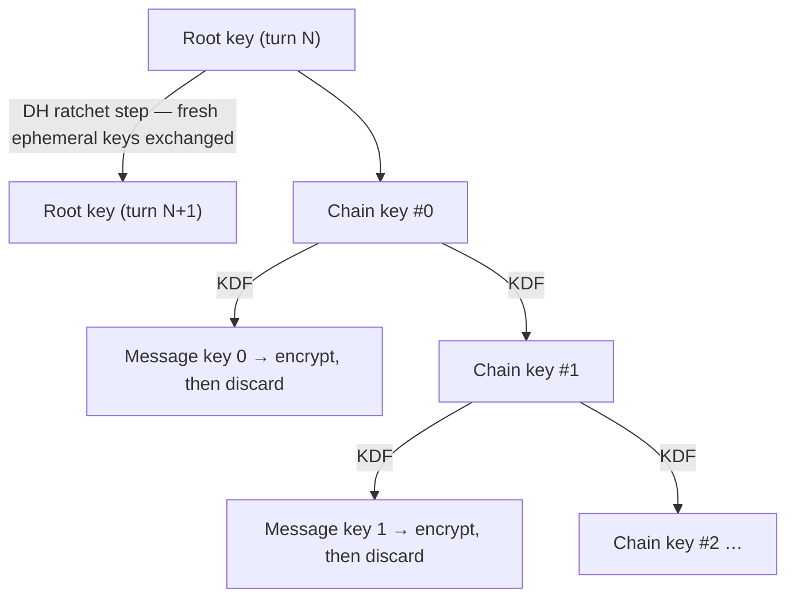

In [the X3DH post](/tech/2026-e2ee-1to1-x3dh), Alice and Bob worked hard to agree on one shared secret, `SK`, before either of them sent a single message. It would be a shame to waste all that effort by just... reusing `SK` to encrypt everything. If that one key ever leaked — a stolen device, a buggy backup — an attacker would be able to read the entire conversation: every message already sent, and every message still to come.

The **Double Ratchet** (the other half of the Signal protocol, also used by WhatsApp and countless others) is what stands between "one good key" and "a fresh key for every single message, in both directions, that heals itself after a compromise." This post covers how it does that — with two ratchets working together, each with a different job.

## What "ratchet" means here

A ratchet — the mechanical kind, the tool — only turns one direction. Click it forward, and it can't slip back. That's precisely the property both halves of this design lean on: **state that only ever advances**, by construction, so that knowing where things are *now* tells you nothing about where they were *before*.



- **The symmetric-key ratchet** runs on *every message*. It takes a "chain key," and from it derives two things: a one-time message key (used once, to encrypt or decrypt this message, then thrown away) and the next chain key. Both come out of a one-way function — so the chain only ever moves forward.
- **The Diffie-Hellman ratchet** runs once per *turn* — whenever the conversation changes direction. Each time someone replies, they attach a freshly generated ephemeral public key. Both sides run a new DH agreement (the same kind of calculation from the X3DH post) and fold the result into a brand-new root key, which reseeds the chains from a starting point neither of them could have predicted in advance.

## Forward secrecy, with numbers you can check by hand

Here's a toy stand-in for the symmetric ratchet's one-way step — small enough to run with pencil and paper. Starting from a secret seed, repeatedly compute `next = (current × current + 1) mod 100`:

```
7 → 50 → 1 → 2 → 5 → 26 → …
```

Every number in that chain plays two roles at once: it *is* this message's key, and it's the seed for the next one. The instant the chain moves from `7` to `50`, the protocol deliberately throws `7` away.

Now say an attacker steals `50`. Running the same recipe forward, they can compute `1`, `2`, `5`, `26`, and everything after — which is expected; the conversation is compromised from this point *on*. But can they recover `7`? That means answering "which number, squared and incremented, lands on `50` modulo `100`?" For toy-sized numbers like these, sure — just try all 100 possibilities. For the 256-bit values a real ratchet derives (via HMAC, not squaring, but with the same forward-only shape), that search is exactly the kind of impossible computation you saw with the discrete logarithm in the X3DH post. **That's forward secrecy**: stealing today's key tells you nothing about yesterday's.

## Self-healing, with the same trick from X3DH

The symmetric ratchet alone has a gap: if an attacker steals your *current* chain key, they can keep grinding the one-way step forward and predict every future message key — forever. The DH ratchet exists to close exactly that gap.

Periodically — whenever the conversation changes direction — Alice and Bob each draw a brand-new ephemeral key pair and run the "agree on a shared number over a public channel" dance from the X3DH post (the `A = 5⁶ mod 23`, `B = 5¹⁵ mod 23`, both arrive at `2` routine). The result gets folded into an entirely new root key — one that depends on two fresh secrets the attacker has never seen and couldn't have predicted. Even holding yesterday's chain key, they have no way to derive it. The conversation **heals itself** the very next time either side replies — a property cryptographers call *post-compromise security*.

## Managing the chain in Go

The symmetric ratchet's entire job fits in one function: derive two outputs from one input, using a one-way primitive (HMAC-SHA-256), and discard the input.

```go
// ratchetStep is the whole symmetric ratchet. One HMAC call yields this
// message's key; a second, with a different label, yields the next chain
// key. Going chainKey → {messageKey, nextChainKey} is trivial — going
// backward means inverting HMAC, which is exactly as infeasible as the
// "square and increment" puzzle above, just at real cryptographic scale.
func ratchetStep(chainKey []byte) (messageKey, nextChainKey []byte) {
	return hmacSHA256(chainKey, []byte("message-key")),
		hmacSHA256(chainKey, []byte("chain-key"))
}
```

The discipline that makes this safe lives entirely outside the function: encrypt with `messageKey`, **immediately overwrite** the stored `chainKey` with `nextChainKey`, and never touch the old value again. That single overwrite *is* the forward-secrecy guarantee — there's no key left to steal once you've moved on. (Out-of-order delivery is handled by caching a bounded number of skipped message keys, indexed by position, so a late-arriving message #41 can still be opened after you've already advanced to #45.)

## A Vue.js sketch: sending a message

On the client, "send a message" is: run the ratchet step, advance the stored state, encrypt, ship it with an index the recipient can use to replay the same derivation.

```js
// One call per outgoing message — never reuse messageKey or chainKey.
function encryptNext(state, plaintext) {
  const { messageKey, nextChainKey } = ratchetStep(state.sendingChainKey)
  state.sendingChainKey = nextChainKey
  state.sendIndex += 1

  const nonce = sodium.randombytes_buf(sodium.crypto_secretbox_NONCEBYTES)
  return {
    index: state.sendIndex,
    nonce: sodium.to_base64(nonce),
    ciphertext: sodium.to_base64(sodium.crypto_secretbox_easy(plaintext, nonce, messageKey)),
  }
}
```

Receiving mirrors this: replay `ratchetStep` forward from the stored receiving chain key up to the incoming `index` (caching any keys you skip past along the way), decrypt with the resulting `messageKey`, and store the new chain key. Whenever an incoming message carries a new ephemeral public key you haven't seen, that's the signal to run a DH ratchet step first — fresh root key, fresh sending and receiving chains, same idea as above just one layer up.

## What this buys you — and the one rule that matters

Put together, X3DH plus the Double Ratchet gives a 1:1 conversation:

- A unique key for every message, derived without any extra round trips
- **Forward secrecy** — compromise today, and yesterday's messages stay unreadable
- **Post-compromise security** — compromise today, and the *next* reply locks the attacker back out

All of it rests on one discipline, repeated at every layer: once a key has done its one job — encrypting a message, seeding the next step — overwrite it and never look back. That's the entire mechanism, and it's also the entire failure mode if you get it wrong: cache too much, persist too long, or reuse a key "just this once," and the ratchet stops protecting you. Reach for a vetted implementation (libsignal, or a well-reviewed port) rather than hand-rolling this part.
