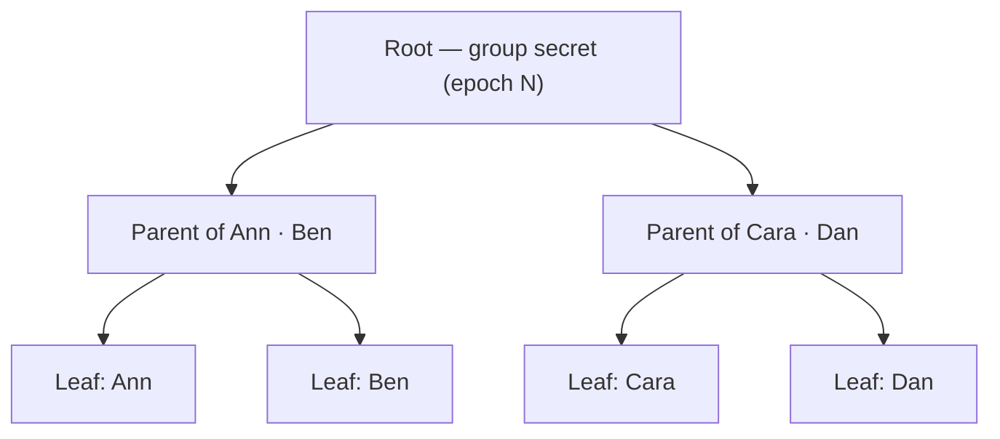

# Group Chat at Scale: How MLS Keeps Hundreds of Devices in Sync

Encrypting a conversation between two people is hard enough — encrypting one between two hundred is a different problem altogether. Reuse the pairwise approach from a Signal-style 1:1 system and a 200-person group needs roughly 20,000 individual encrypted sessions; add or remove a single member and a meaningful slice of those sessions has to be rebuilt.

**MLS — Messaging Layer Security (RFC 9420)** — is the IETF-standardized answer. It gives a group of *any* size one shared encryption key that can be refreshed in roughly `log₂(group size)` steps instead of `n²`. This post covers how its core data structure, the **ratchet tree**, pulls that off, then walks through a Go key manager, a Vue.js group-chat client, and a numbers-only analogy for anyone in the room who isn't a cryptographer.

## Why the pairwise model doesn't scale

In a Signal-style design, an `n`-person group needs `n·(n-1)/2` pairwise sessions just so everyone can talk to everyone. Worse, the moment one member is removed — a phone is lost, someone leaves the team — every *other* member has to discard their session with that person and often re-derive shared key material from scratch, an operation whose cost grows with the group.

MLS instead gives the whole group **one shared secret per "epoch"** — a version counter for the group's state — arranged so that adding, removing, or rotating a single member's keys only requires recomputing a small, predictable slice of the group's key material.

## The ratchet tree

Picture the group's members as the leaves of a binary tree. Every internal ("parent") node also holds a key pair — but a *derived* one, computed from its two children. The root node's secret effectively *is* the group's shared secret.



When Ben needs to rotate his key — say he just reinstalled the app on a new phone — only the nodes on the **path from his leaf to the root** have to change: his own leaf, the "Ann · Ben" parent, and the root. Ann's leaf, Cara and Dan's leaves, and the "Cara · Dan" parent all stay exactly as they were. For a balanced tree of `n` members that path has length `log₂(n)` — for a 1,024-person group, that's 10 nodes to update instead of 1,024.

This data structure is called **TreeKEM** in the MLS spec, and the "refresh only your path" operation is bundled into a message type called a **Commit**.

## Epochs: the group's heartbeat

Every Commit — adding a member, removing one, or simply rotating a key — advances the group to a new **epoch**. Each epoch derives its own family of secrets (an encryption secret, a sender-authentication secret, an "exporter" secret other protocols can hook into, and the seed for the *next* epoch) through a defined **key schedule**. That buys two properties that matter enormously for messaging:

- **Forward secrecy** — secrets from epoch *N* can't be reconstructed from epoch *N+1*'s state, so a later compromise doesn't expose earlier conversations
- **Post-compromise security** — once a compromised member rotates their key (advancing the epoch), an attacker who stole their old key is locked out again

## A numbers-only version of the ratchet tree

Here's the same *shape* of idea using nothing but addition. (Real MLS replaces every step below with public-key encryption — specifically [HPKE](https://www.rfc-editor.org/rfc/rfc9180) — so nobody ever has to *reveal* their private number to combine it. The pattern of what changes and what doesn't, though, is identical.)

Four friends — Ann, Ben, Cara, Dan — each privately pick a secret number and want to land on one shared "group number" without anyone announcing their own:

- **Leaves:** Ann picks `7`, Ben picks `4`, Cara picks `9`, Dan picks `2`
- **Parents** combine siblings with a one-way mixing rule — here, simply `(x + y) mod 13`:
  - Ann · Ben → `(7 + 4) mod 13 = 11`
  - Cara · Dan → `(9 + 2) mod 13 = 11`
- **Root (the group secret):** `(11 + 11) mod 13 = 9`

Now suppose Ben gets a new phone and picks a fresh secret, `10`:

- New Ann · Ben parent → `(7 + 10) mod 13 = 4`
- New root → `(4 + 11) mod 13 = 2`

The group's shared number moves from `9` to `2` — and **Cara and Dan's branch was never touched**. Everyone can recompute the new root as long as they learn the values that changed along Ben's path; the rest of the tree is arithmetic they already knew. That's MLS's central trick: a key rotation anywhere in the group only ripples along one path to the root, and the cost of that path grows with the tree's *height*, not with the number of people in it.

## Managing keys in Go

Strip away the bookkeeping (tracking node IDs, persisting the tree, talking to the server) and a client's update-path logic comes down to one small loop: walk from your leaf to the root, deriving each next secret from the previous one with HKDF.

```go
// walkUpdatePath regenerates every secret from a freshly-rotated leaf key
// up to the root. Each step's output seeds the next — exactly the "new
// number at each parent" arithmetic from the analogy above, just with a
// one-way KDF standing in for addition. Cost: one HKDF call per node on
// the path, i.e. O(log2(group size)).
func walkUpdatePath(leafSecret []byte, coPathNodeIDs []uint32) (groupSecret []byte, err error) {
	current := leafSecret
	for _, nodeID := range coPathNodeIDs {
		current, err = hkdfExpand(current, fmt.Sprintf("mls-ratchet-node-%d", nodeID))
		if err != nil {
			return nil, err
		}
	}
	return hkdfExpand(current, "mls-ratchet-epoch-secret")
}
```

`hkdfExpand` is just `hkdf.New(sha256.New, secret, nil, []byte(label))` read out to 32 bytes — the same primitive the X3DH post uses to fold DH outputs together. The values returned along the way (the `PathSecret`s) are what get HPKE-encrypted to each node's co-path in a real Commit message; nobody ever transmits `leafSecret` or `current` in the clear.

> In production, reach for a vetted implementation — [OpenMLS](https://github.com/openmls/openmls) or AWS's [mls-rs](https://github.com/awslabs/mls-rs) — rather than rolling your own tree synchronization and HPKE handling. This snippet exists to make the *shape* of the key schedule concrete, not to ship as-is.

## A Vue.js group chat client

The client-side shape mirrors the 1:1 case: fetch/receive some key material, derive a symmetric secret, then use `crypto_secretbox_easy` to encrypt and `crypto_secretbox_open_easy` to decrypt. The only genuinely new piece is *where the secret comes from* — not a DH agreement, but whatever the server just delivered for the current epoch:

```js
// A brand-new member learns the group secret from a "Welcome": an
// HPKE-sealed path secret only their own leaf key can open.
async function joinFromWelcome(welcome, myKeyPair) {
  const pathSecret = sodium.crypto_box_seal_open(
    sodium.from_base64(welcome.encryptedPathSecret),
    myKeyPair.publicKey,
    myKeyPair.privateKey,
  )
  return sodium.crypto_generichash(32, pathSecret, sodium.from_string(`epoch-${welcome.epoch}`))
}

// Existing members just receive the new secret directly inside a "Commit"
// once someone's path update has been applied.
function applyCommit(commit) {
  return { secret: sodium.from_base64(commit.groupSecret), epoch: commit.epoch }
}
```

Either way, the component ends up holding one `group.secret` for the current epoch — the same value every other member derived through their own path — and uses it exactly like the 1:1 session key: seal outgoing messages, open incoming ones, and swap it out the moment a new epoch's Commit arrives. The client never has to ask "what's everyone else's private key?" — only "what's the secret for *this* epoch?"

## What you get — and what you still have to build

MLS gives you:

- A group key that costs `O(log n)` to rotate, instead of `O(n)` or `O(n²)`
- Forward secrecy and post-compromise security on every epoch transition
- A server that only ever sees ciphertext and tree metadata — never plaintext, never private keys

It does *not* hand you, out of the box:

- Application-level message framing, ordering, or offline delivery
- UI for device verification (the group equivalent of "safety numbers")
- Handling for the messy realities of mobile networks — retried Commits, out-of-order Welcome messages, devices that vanish mid-handshake

Those are exactly the parts worth spending engineering effort on, once the cryptographic core comes from a library that's had its math checked by people who do this for a living.
