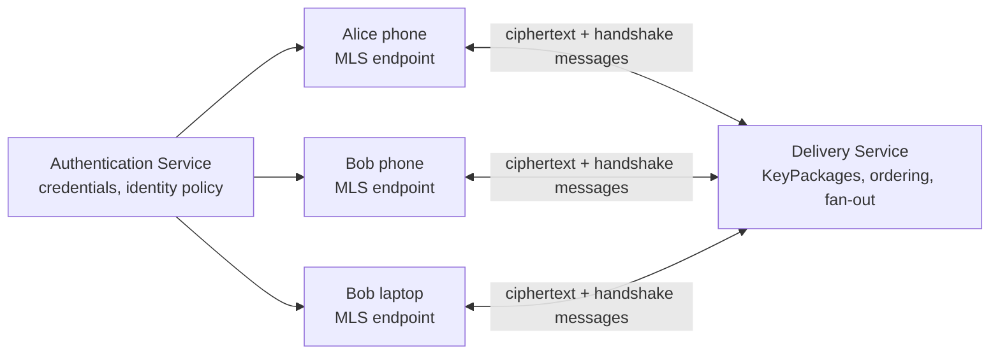
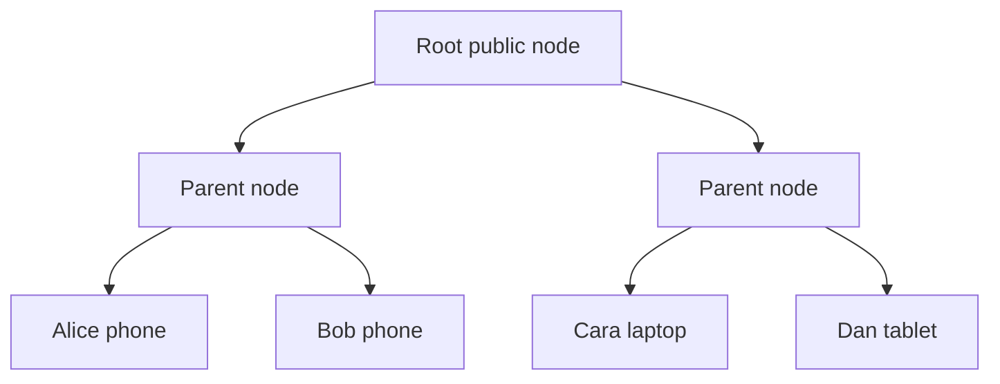
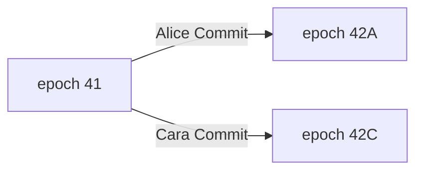

Pairwise encryption is a natural foundation for 1:1 chat. It becomes expensive and operationally awkward when a room contains hundreds of devices and membership changes often. **Messaging Layer Security (MLS), standardized in RFC 9420**, gives all current members a consistent authenticated group state, efficient membership changes, forward secrecy, and post-compromise security.

The cryptography is only half the engineering. A production client must also answer:

- Which Commit wins when two members change the same epoch concurrently?
- What should an offline device do after missing five epochs?
- When is it safe to deliver a Welcome to a new member?
- Who is allowed to add or remove a device?
- Which group state can be persisted or backed up without undoing forward secrecy?
- How are malformed, replayed, stale, or policy-invalid messages rejected?

OpenMLS implements the MLS protocol in Rust, but it deliberately does not invent those product policies or the network service around them. This post connects the protocol to that application state machine.

## First correction: MLS is not “one group key from the server”

The Delivery Service transports public KeyPackages, handshake messages, Welcome messages, and encrypted application messages. It does **not** generate or distribute a plaintext group secret.

The clients independently derive matching epoch secrets by processing the same authenticated Commit history. From an epoch’s key schedule they derive separate secrets for encryption, authentication, exporters, resumption, confirmation, membership, and the next epoch. MLS also derives sender-specific ratchets for application messages so the application does not reuse one static AES key for every member and message.

It is therefore safer to think:

> one agreed cryptographic group state per epoch, with many purpose-specific derived keys

rather than:

> one group key everybody reuses

## A member is normally a device, not a person

In MLS, a leaf represents a **client**. A person with a phone and laptop normally occupies two leaves with two credentials and two independent private states. This matters for device removal: losing a phone should remove that phone’s leaf without pretending the whole account left.

The application may group device credentials under one user identity, but that mapping lives in the Authentication Service and product policy. MLS authenticates credentials and signatures; it does not decide that `device-93` is really Quan’s new laptop.

## The surrounding architecture

RFC 9750 describes the pieces around the protocol:



- The **Authentication Service (AS)** defines credential issuance, validation, expiration, revocation, and the mapping from application identity to MLS client.
- The **Delivery Service (DS)** distributes KeyPackages and messages, broadcasts to members, and usually serializes state-changing Commits.
- The **clients** own private tree state, validate every protocol transition, and encrypt/decrypt application data.

A compromised DS should not be able to read or forge valid application messages, but it can still deny service, delay members, withhold a Commit from selected devices, and attempt rollback or fork behavior. Clients need consistency checks and user-visible recovery, not blind trust in delivery success.

## TreeKEM without the misleading shortcut

MLS represents members as leaves of a binary **ratchet tree**. Each leaf has an encryption key and signature credential. Internal nodes may have public encryption keys; members hold only the private secrets they are entitled to know.



When Bob commits a fresh update, he generates a new leaf secret and derives new secrets **up his direct path** toward the root. For each level he HPKE-encrypts the relevant path secret to a resolution on the sibling side—the **co-path**—so every authorized member can recover enough information to derive the new epoch state, while removed members cannot.

The parent secret is not simply a hash of both child private keys, and the root node is not a reusable application encryption key. TreeKEM is an authenticated key-agreement mechanism that contributes a `commit_secret` to the MLS key schedule.

In a balanced tree, an update path contains roughly `log₂(n)` levels. That is the central scaling win: a membership change does not require building pairwise sessions between every pair of members.

## What the complexity claim does—and does not—mean

“MLS updates cost O(log n)” is useful but incomplete:

- The UpdatePath has logarithmically many levels and encrypted path-secret groups.
- Every active member still needs to receive and process the Commit.
- A Welcome can carry or reference enough tree information for a joiner to reconstruct group state.
- Application-message delivery still needs network fan-out to recipients.
- Credential validation and application roster work may be linear in group size.
- Large bursts of joins/leaves create key churn even when each individual tree operation is efficient.

MLS improves cryptographic key-update scaling. It does not turn a 10,000-device room into a free distributed system.

## Epochs: the state machine everyone must agree on

A new group starts at epoch 0. Every accepted Commit advances exactly one epoch:

```text
epoch 41 --Commit--> epoch 42 --Commit--> epoch 43
```

A Commit covers zero or more **Proposals**:

- `Add`: add a KeyPackage/client;
- `Update`: replace a member’s leaf information;
- `Remove`: blank/remove a leaf;
- `PreSharedKey`: mix approved external or resumption PSK material into the schedule;
- `ReInit`: migrate the group to new parameters in a new group;
- `GroupContextExtensions`: replace the group’s extension list;
- `ExternalInit`: used within an external Commit.

Proposals can be sent first and referenced later, or included directly by value in the Commit. The Commit authenticates the transition, updates the tree and transcript, and derives the next epoch.

If Alice and Cara both create a Commit from epoch 41, those two transitions are siblings, not a sequence. A normal MLS group cannot merge both independently:



The application/DS must choose one. The losing client discards its pending Commit, applies the winner, and retries any still-valid intent against the new epoch.

## Proposal, Commit, Welcome, and GroupInfo

These messages have different audiences:

- A **Proposal** requests a state change but does not apply it.
- A **Commit** applies proposals and advances existing members.
- A **Welcome** gives newly added members encrypted information needed to join the post-Commit epoch.
- A signed **GroupInfo** describes a specific epoch and can support external joins or other integrations.

An Add proposal alone does not make the new client a member. The client joins the state created by the Commit and learns it through the matching Welcome. Delivering the Welcome before the DS accepts that Commit can create a new client on an epoch the group never adopted.

New members normally cannot decrypt old application messages. History sharing, if a product wants it, is a separate explicitly designed feature with its own keys and policy.

## OpenMLS: the provider boundary

OpenMLS uses an `OpenMlsProvider` for cryptography, randomness, and storage, plus an `OpenMlsSigner` for signing. This abstraction is not incidental. The storage provider holds sensitive group and key-package state and must make updates durable in the order the protocol expects.

A practical system typically stores:

- credentials and signature keys;
- generated KeyPackages and their private key material;
- one `MlsGroup` state per group/client;
- application mapping from MLS group ID and leaf credential to product room/device IDs;
- delivery cursors and retry metadata outside the cryptographic state.

OpenMLS continuously persists group state through the provider. Its forward-secrecy documentation warns that old key material deleted through the storage interface must be **irrecoverably deleted**. A database snapshot, cloud backup, or append-only log that resurrects deleted secrets can weaken the security property even when the Rust state machine is correct.

## The safe add-member flow

The exact API evolves, but the important ordering is stable. With a recent OpenMLS-style API, an existing member creates a Commit and Welcome:

```rust
let (commit, welcome, group_info) = alice_group.add_members(
    provider,
    &alice_signer,
    &[bob_key_package],
)?;

// alice_group now has a pending Commit. Do not publish application
// messages from an imagined next epoch yet.
delivery_service.submit_commit(room_id, commit).await?;

// Only after the DS atomically accepts this as the next room Commit:
alice_group.merge_pending_commit(provider)?;

// The Welcome belongs to that accepted post-Commit epoch.
delivery_service.deliver_welcome(bob_device_id, welcome).await?;
```

Production code needs one extra distinction: “HTTP 200” is not necessarily “globally selected as the next Commit.” The DS operation should be a compare-and-swap against `(group_id, expected_epoch, expected_transcript/reference)`, return the authoritative sequence position, and make fan-out idempotent.

If the DS rejects Alice because Cara’s Commit won, Alice clears local pending state:

```rust
alice_group.clear_pending_commit(provider.storage())?;
// Fetch/process Cara's accepted Commit, then rebuild Alice's operation.
```

For an external-join Commit, OpenMLS requires stronger cleanup: if that staged join is discarded, the provisional group instance itself should be deleted.

## Joining from a Welcome

OpenMLS intentionally stages the operation so the application can inspect before accepting:

```rust
let processed = ProcessedWelcome::new_from_welcome(
    provider,
    &join_config,
    welcome,
)?;

// Inspect unverified metadata only as hints. Build the staged state,
// then validate verified group information and credentials under app policy.
let staged = processed.into_staged_welcome(provider, None)?;
validate_inviter_and_membership(&staged, auth_service)?;

let bob_group = staged.into_group(provider)?;
```

If the group does not carry the ratchet-tree extension, the joiner needs the tree through an application-defined channel. If the user declines the invitation, discard the Welcome/staged state so consumed key-package material and temporary secrets do not linger.

A KeyPackage is normally one-time material. Reusing it across unrelated joins increases replay/linkability risk and violates the lifecycle expected by the library. Generate and replenish packages; do not clone a device’s private KeyPackage state into another device.

## Processing an incoming Commit

OpenMLS returns a staged transition rather than silently mutating trusted product state. That is the correct place to enforce authorization:

```rust
let processed = group.process_message(provider, protocol_message)?;

match processed.into_content() {
    ProcessedMessageContent::StagedCommitMessage(staged) => {
        validate_credentials(&staged, auth_service)?;
        validate_add_remove_permissions(&group, &staged, room_policy)?;
        validate_device_roster_effects(&group, &staged, account_store)?;

        group.merge_staged_commit(provider, *staged)?;
    }
    ProcessedMessageContent::ApplicationMessage(app) => {
        persist_authenticated_plaintext(app.into_bytes())?;
    }
    ProcessedMessageContent::ProposalMessage(proposal) => {
        validate_and_queue_proposal(proposal, room_policy)?;
    }
    _ => {}
}
```

Cryptographic validity is necessary, not sufficient. A perfectly signed Remove from an ordinary member may still violate a room where only administrators may remove devices. OpenMLS lets the application inspect the `StagedCommit` before merge precisely because authorization belongs above the protocol.

## The edge cases that dominate real implementations

### 1. Two Commits race from the same epoch

Only one can become the canonical next state. The DS should serialize Commits per group using an atomic expected-epoch check. The loser clears its pending Commit, processes the winner, and retries proposals that remain meaningful.

Never merge the local pending Commit merely because it was successfully encrypted and uploaded. Selection and durable ordering must be confirmed.

### 2. A proposal exists but nobody commits it

A Proposal does not change membership. The RFC requires a member that has observed proposals to commit them before sending more application data in relevant cases; OpenMLS may refuse application-message creation while pending proposals remain. Decide who acts as committer, how long proposals wait, and how failed committers are replaced.

### 3. A valid proposal is omitted from the winning Commit

Asynchronous clients may not all have seen the same proposal set. Receivers should not assume every valid proposal must appear in the next Commit. If the omitted proposal remains applicable, update it for the new epoch and resend/recommit it.

### 4. The device receives epoch 44 but is still at epoch 42

It cannot skip the state-changing Commit for epoch 43 and derive epoch 44. The DS should provide ordered handshake history or a checkpoint/resync mechanism. An external resync Commit can be appropriate when the application policy permits it; otherwise re-add the device with a fresh KeyPackage and Welcome.

Do not “fix” the mismatch by copying another device’s serialized `MlsGroup`. Each client owns leaf-specific private state.

### 5. Application messages arrive before the Commit that created their epoch

Buffer them by `(group_id, epoch)` within strict size/time limits, fetch missing handshake messages, process the Commit chain, then retry. Unlimited buffering is a memory-DoS vector.

### 6. Old application messages arrive after advancing

OpenMLS can retain a configured number of past-epoch secrets for delayed messages. A larger window improves unreliable-network tolerance but keeps old decryption material longer and weakens the practical deletion window. Choose a bounded policy and test it.

### 7. The DS accepts a Commit but Welcome delivery fails

Existing members have advanced and the new member has been added cryptographically, but that device cannot yet join. Retrying the same encrypted Welcome is reasonable if delivery is idempotent and the KeyPackage state remains available. Creating a second Add blindly can produce duplicate leaves.

The product may eventually remove the unreachable leaf with a new Commit.

### 8. Welcome is delivered before Commit acceptance

The joiner may build a valid local state for a branch the room rejects. OpenMLS documentation explicitly warns against this ordering. Accept Commit first, then release Welcome.

### 9. A Remove has several product meanings

At the protocol level it removes a leaf. At the product level it might mean:

- I left voluntarily;
- an admin removed me;
- one lost device was revoked but the user remains;
- an account was removed entirely;
- another member left.

Render the correct UX from the sender, target leaf, account-to-device mapping, and authorization policy—not from “there is a Remove proposal” alone.

### 10. Add and Remove conflict

RFC proposal validation rejects invalid combinations such as updating and removing the same leaf in one Commit. Application policy must also catch semantic duplicates: adding a device already present, removing the final admin, or accepting two credentials for one prohibited device identity.

### 11. Credential expires or is revoked

MLS does not poll the identity provider for you. Validate credentials when joining and when processing staged Adds/Updates. Define whether expiration blocks messages immediately, requires a self-update, or triggers an administrator Remove.

### 12. A client crashes around merge

Network acknowledgment, application roster update, and `MlsGroup` persistence must be recoverable as one logical transition. Use idempotent delivery IDs and transactional local metadata. On restart, load the authoritative group state and cursor; never reconstruct an epoch from UI roster rows alone.

### 13. Storage restores an old group snapshot

The client can reuse message generations or erased private secrets and may attempt to fork from a stale epoch. Protect MLS state with rollback-aware storage/version counters where possible, and treat ordinary backup/restore as a cryptographic protocol feature—not merely database copying.

### 14. The same ciphertext is replayed

MLS includes sender data, generation counters, transcript/state binding, and a reuse guard. Libraries perform protocol checks, but the DS and application still need idempotent message IDs so a retried delivery does not create duplicate visible chat items.

### 15. Membership changes arrive in a burst

Committing every join independently can cause large rooms or meetings to spend all their time advancing epochs. Batch compatible proposals within a short bounded window, while ensuring a proposed removal is committed before sending sensitive new application data. Cisco’s public Webex material describes using timers to reduce key churn when many participants join close together.

### 16. A member needs history

MLS intentionally protects earlier epochs from a new member. If the app offers history, encrypt an explicit history bundle to the new authorized device under a separate, auditable mechanism. Do not retain every old epoch secret and call that history sync.

### 17. Attachments, calls, and search

MLS can derive exporter secrets for other application purposes, but the application must define domain-separated labels and context. Large attachments normally use random content keys and encrypted object storage. Calls may use MLS to establish participant state and SFrame-style media keys. Server-side plaintext search, recording, moderation, and bots require separate trust decisions.

## A concrete state model for the client

Treat each room/client as one of these operational states:

| State | Allowed work |
|---|---|
| Active, no pending proposals/commit | Encrypt app data; create proposals or Commit |
| Active, pending proposals | Validate/commit proposals before more app data according to policy |
| Active, local pending Commit | Await DS selection; do not accept a competing local future as canonical |
| Missing epoch(s) | Buffer bounded future data; fetch/process ordered handshake messages |
| Joining from Welcome | Inspect and validate; create group only for an accepted Commit |
| Removed | Stop encrypting/decrypting new epochs; retain only product-approved local history |
| Needs resync | External resync or fresh Add/Welcome according to policy |

Logging should record group ID, epoch, leaf index, message type, proposal references, DS sequence ID, and error class. It must never record epoch secrets, private tree state, plaintext, exporter outputs, or serialized providers containing secret keys.

## Real deployments

### Webex Meetings

Cisco publicly documented using draft MLS keying for end-to-end encrypted Webex meetings, combined with identity certificates and SFrame media encryption. A participant join or leave produces new meeting key material; the cloud routes the meeting but does not receive the E2EE media key. This is a useful reminder that MLS can secure dynamic real-time membership, not only text chat.

It also exposes the product tradeoff: traditional cloud recording, PSTN/SIP gateways, transcription, and server-side media services cannot remain blind while processing plaintext. E2EE mode must disable, redesign, or explicitly trust endpoints for those features.

### Wire

Wire announced general availability of MLS across its collaboration products in April 2025 and described support for groups with thousands of members. Its rollout reporting also mentioned backend load and client issues during migration—evidence that efficient protocol asymptotics do not remove rollout, compatibility, storage, and delivery complexity.

These are deployments of MLS-based systems, not proof that copying one vendor’s service architecture makes another product secure. Credential policy, DS ordering, device lifecycle, history, and operational recovery remain application-specific.

## What MLS gives you

- standardized asynchronous group key agreement;
- efficient tree-based membership updates;
- authenticated group state and transcript consistency;
- forward secrecy when old key material is actually erased;
- post-compromise security after honest fresh updates;
- encrypted application messages with sender ratchets;
- exporters for carefully separated application integrations.

## What MLS does not give you

- account/device identity policy;
- administrator authorization rules;
- a Delivery Service or its Commit-serialization contract;
- push notifications, offline queues, deduplication, and UI ordering;
- cross-device history or backup;
- attachment storage and lifecycle;
- spam prevention, abuse reporting, moderation, recording, or search;
- automatic recovery from arbitrary stale/corrupt local state;
- protection from a compromised endpoint displaying plaintext.

## Production checklist

- Treat each device as a leaf with independently issued and revocable credentials.
- Atomically serialize Commits per group/epoch at the DS.
- Merge local pending state only after the Commit is accepted as canonical.
- Deliver Welcome only after its associated Commit is accepted.
- Validate credentials and product authorization before merging every staged Commit.
- Consume KeyPackages correctly and replenish them without copying private state.
- Define bounded buffering and past-epoch retention for out-of-order messages.
- Make local state transitions, delivery cursors, and roster updates crash-recoverable.
- Ensure storage deletion is real; do not resurrect erased MLS secrets from backups.
- Design explicit resync, reinstall, device-revocation, and identity-change flows.
- Batch membership churn carefully without delaying important removals.
- Test racing Commits, omitted proposals, stale epochs, duplicate delivery, failed Welcome, revoked credentials, restored snapshots, and large-room churn.
- Use OpenMLS and its test vectors; do not reimplement TreeKEM or the key schedule from a diagram.

MLS solves the hard cryptographic core of dynamic group membership. OpenMLS turns that standard into a usable library. The remaining difficulty is making every database transaction, delivery acknowledgment, identity decision, and retry preserve the single rule the protocol depends on: all honest members must advance through the same authenticated sequence of epochs.

## Further reading

- [RFC 9420: The Messaging Layer Security Protocol](https://www.rfc-editor.org/rfc/rfc9420.html)
- [RFC 9750: The MLS Architecture](https://www.rfc-editor.org/rfc/rfc9750.html)
- [OpenMLS Book](https://book.openmls.tech/)
- [OpenMLS: Joining from a Welcome](https://book.openmls.tech/user_manual/join_from_welcome.html)
- [OpenMLS: Processing incoming messages](https://book.openmls.tech/user_manual/processing.html)
- [OpenMLS: Persistence and forward-secrecy considerations](https://book.openmls.tech/user_manual/persistence.html)
- [Wire’s MLS general-availability announcement](https://wire.com/en/blog/wire-mls-is-now-generally-available)
